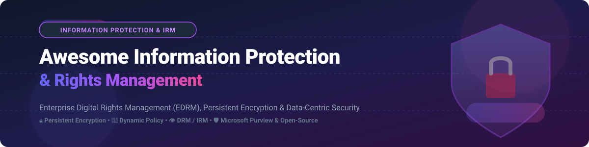

<p align="center">
  
</p>

# 🛡️ Awesome Information Protection & Rights Management

<p align="center">
  <a href="https://github.com/ishandutta2007/Awesome-Awesome-Awesome"></a><a href="https://discord.gg/jc4xtF58Ve"></a>
  <a href="https://github.com/ishandutta2007/Awesome-Information-Protection-Rights-Management/stargazers"></a>
  <a href="https://github.com/ishandutta2007/Awesome-Information-Protection-Rights-Management/network/members"></a>
  <a href="https://github.com/ishandutta2007"></a>
</p>

## 🔐 Top Information Protection & Rights Management Platforms Ecosystem

**📋 Curated List of SaaS Products & Open-Source GitHub Projects**

*Focused on Enterprise Digital Rights Management (EDRM), Information Rights Management (IRM), Persistent File Encryption, Dynamic Usage Controls, Data Loss Prevention (DLP) & Data-Centric Security.*

**📅 Last updated: October 2026**

---

### 📌 Overview & SEO Keywords
This repository tracks leading **SaaS platforms** and **open-source projects** for **Information Protection & Rights Management (IRM/DRM)**. These security systems apply persistent encryption, attribute-based access control (ABAC), and granular permissions to sensitive files (PDF, Office, CAD, Source Code). Protection travels with data across endpoints, cloud storage, email, and external collaborators—enforcing dynamic revocation and read/edit/print/watermark permissions anywhere.

**Key Technology Pillars**: *Information Rights Management (IRM)*, *Enterprise Digital Rights Management (EDRM)*, *Data-Centric Security*, *Persistent File Encryption*, *Sensitivity Labeling*, *Content Disarm and Reconstruction (CDR)*, *Zero Trust Data Protection*, *Open Policy Agent (OPA)*.

**🔓 Commercial & Open-Source Landscape**: Complete enterprise IRM solutions with native desktop OS integration, dynamic policy servers, and application-level DRM hooks are predominantly enterprise SaaS/commercial platforms. Open-source ecosystems provide robust foundational cryptographic libraries, policy engines, and self-hosted secure storage nodes.

🤝 Contributions welcome! Open a PR to add or update entries. Keep descriptions factual and link to official project repositories or official platform sites.

---

## 📚 Table of Contents
- ☁️ [SaaS/Hosted Platforms](#%EF%B8%8F-saas-hosted-platforms)
- 💻 [Open-Source GitHub Projects](#-open-source-github-projects)
- 🤝 [How to Contribute](#-how-to-contribute)
- 💖 [Support & Community](#-support--community)
- ⚠️ [Disclaimer](#%EF%B8%8F-disclaimer)
- 📈 [Star History](#-star-history)

---

## ☁️ SaaS/Hosted Platforms

> **Market Size & Concentration**: The global Information Rights Management (IRM) and Data-Centric Security market is estimated at **$5.2 Billion in 2026**, growing at a ~21% CAGR. The sector is **moderately concentrated**, led by major cloud ecosystem providers (Microsoft Purview) alongside specialized enterprise security leaders (Seclore, Virtru, Fasoo, OpenText).

| Platform / Vendor | Description & Key Capabilities | Market Size / Company Size (Revenue or Valuation) | Specific Starting Price | Free Tier / Free Trial Limits |
| :--- | :--- | :--- | :--- | :--- |
| **[Microsoft Purview Information Protection](https://www.microsoft.com/en-us/security/business/information-protection/microsoft-purview-information-protection)** | Enterprise-grade sensitivity labeling, persistent AES encryption, rights management, and DLP integrated into Microsoft 365 and Windows. | **~$245 Billion Revenue** (Microsoft Security >$20B) | **$9.00/user/month** (Microsoft 365 E3 add-on or Purview Information Protection Plan 1) | **1 Month Free Trial** (Includes 25 Microsoft 365 Enterprise developer/trial licenses) |
| **[OpenText IRM](https://www.opentext.com/)** | Enterprise document control and information rights management for securing external file sharing and sensitive IP. | **~$5.8 Billion Revenue** (Publicly Traded: OTEX) | **$12.00/user/month** (Enterprise IRM starting tier) | **30-Day Free Trial** (Full enterprise admin dashboard evaluation) |
| **[Fasoo Enterprise DRM](https://www.fasoo.com/)** | Centralized EDRM platform providing document-level security, screen capture prevention, dynamic watermarking, and usage tracking. | **~$350 Million Market Cap** (Publicly Traded: 150900.KQ) | **$15.00/user/month** (Fasoo Data Security Framework starting tier) | **14-Day Enterprise Trial** (Up to 10 user accounts) |
| **[Seclore Rights Management](https://www.seclore.com/)** | Data-centric security platform providing agentless IRM, granular permission revocation, and automated policy enforcement. | **~$150 Million Valuation** | **$10.00/user/month** (Seclore Lite / Essential starting tier) | **14-Day Free Trial** (Supports file protection & revocation tests) |
| **[Virtru](https://www.virtru.com/)** | Zero-trust data protection platform providing persistent encryption and access controls for Google Workspace, Outlook, and file stores. | **~$120 Million Valuation** | **$8.00/user/month** (Virtru Starter for Email & File Encryption) | **14-Day Free Trial** (Full encryption & access control features) |
| **[NextLabs](https://www.nextlabs.com/)** | Attribute-based access control (ABAC) and enterprise digital rights management for SAP, CAD files, and multi-cloud documents. | **~$80 Million Valuation** | **$20.00/user/month** (SkyDRM Enterprise starting tier) | **30-Day Free Evaluation** (Supports up to 5 admin seats) |
| **[Votiro](https://www.votiro.com/)** | Positive selection Content Disarm & Reconstruction (CDR) with real-time zero-day malware sanitization and file security. | **~$60 Million Valuation** | **$5.00/user/month** (Votiro Cloud API Sanitization starting tier) | **30-Day Free Trial** (Up to 1,000 scanned/sanitized files) |
| **[SealPath](https://www.sealpath.com/)** | User-friendly information rights management providing persistent document protection, remote wiping, and access analytics. | **~$30 Million Valuation** | **$7.50/user/month** (SealPath Enterprise Professional starting tier) | **14-Day Free Trial** (Full access to desktop & mobile protection tools) |

---

## 💻 Open-Source GitHub Projects

Below are top open-source tools, cryptographic libraries, policy engines, and secure file storage frameworks used to build custom data-centric protection architectures and rights enforcement workflows.

| Project / Repository | Stars_Count | Category | Description & Capabilities |
| :--- | :--- | :--- | :--- |
| **[OpenSSL](https://github.com/openssl/openssl)** | [](https://github.com/openssl/openssl/stargazers) | Cryptographic Toolkit | De-facto enterprise cryptographic library implementing SSL/TLS, AES file encryption, PKI key management, and cryptographic standards. |
| **[Open Policy Agent (OPA)](https://github.com/open-policy-agent/opa)** | [](https://github.com/open-policy-agent/opa/stargazers) | Policy Engine | General-purpose policy engine enforcing fine-grained usage policies and attribute-based access control (ABAC) across data pipelines. |
| **[age](https://github.com/FiloSottile/age)** | [](https://github.com/FiloSottile/age/stargazers) | Secure File Encryption | Simple, modern, and secure file encryption tool featuring small explicit keys, SSH key support, and streamlined CLI workflows. |
| **[Vault (HashiCorp)](https://github.com/hashicorp/vault)** | [](https://github.com/hashicorp/vault/stargazers) | Secrets & Key Management | Enterprise secret management, dynamic encryption key generation, and access control for securing encryption keys at scale. |
| **[libsodium](https://github.com/jedisct1/libsodium)** | [](https://github.com/jedisct1/libsodium/stargazers) | Crypto Primitives | Easy-to-use, high-speed cryptographic library for encryption, decryption, signatures, password hashing, and key exchange. |
| **[CryFS](https://github.com/cryfs/cryfs)** | [](https://github.com/cryfs/cryfs/stargazers) | Encrypted File System | Open-source file system that encrypts file contents, file sizes, metadata, and directory structures for cloud storage security. |
| **[Cryptomator](https://github.com/cryptomator/cryptomator)** | [](https://github.com/cryptomator/cryptomator/stargazers) | Client-Side Encryption | Multi-platform client-side transparent encryption for cloud storage (Dropbox, Google Drive, OneDrive) protecting file privacy. |
| **[OwnCloud / Nextcloud Server](https://github.com/nextcloud/server)** | [](https://github.com/nextcloud/server/stargazers) | Secure Content Collaboration | Self-hosted productivity platform providing end-to-end encryption, file access control rules, and document classification apps. |
| **[Tutanota / Tuta](https://github.com/tutao/tutanota)** | [](https://github.com/tutao/tutanota/stargazers) | Encrypted Communication | Open-source end-to-end encrypted email service protecting client communications, attachments, and file exchanges. |
| **[GnuPG (GPG)](https://github.com/gpg/gnupg)** | [](https://github.com/gpg/gnupg/stargazers) | OpenPGP Standard | Complete and free implementation of the OpenPGP standard for encrypting, signing, and managing sensitive files and keys. |
| **[Cerbos](https://github.com/cerbos/cerbos)** | [](https://github.com/cerbos/cerbos/stargazers) | Authorization Service | Open-source context-aware access control service for defining context-aware authorization policies for application data. |
| **[PyMuPDF](https://github.com/pymupdf/PyMuPDF)** | [](https://github.com/pymupdf/PyMuPDF/stargazers) | PDF Security & Redaction | High-performance Python binding for MuPDF allowing PDF document encryption, digital signatures, permissions setting, and sanitization. |

---

### 🛠️ Building Custom IRM / EDRM Workflows

```
┌──────────────────────────┐      ┌──────────────────────────┐      ┌──────────────────────────┐      ┌──────────────────────────┐
│ 1. Classification & Tag  │ ---> │ 2. Persistent Encryption │ ---> │ 3. Policy Enforcement    │ ---> │ 4. Audit & Revocation    │
│    (PyMuPDF / Metadata)  │      │    (libsodium / age)    │      │    (OPA / Cerbos ABAC)  │      │    (Vault / Central Log) │
└──────────────────────────┘      └──────────────────────────┘      └──────────────────────────┘      └──────────────────────────┘
```

- **Classification**: Identify document sensitivity and embed signed metadata headers.
- **Persistent Encryption**: Encrypt files using symmetric keys managed via **HashiCorp Vault**.
- **Dynamic Policy Enforcement**: Evaluate user identity, device posture, and environment with **Open Policy Agent (OPA)** or **Cerbos**.
- **Usage Control**: Restrict file actions (read-only, disable print) within authorized viewer applications.

---

## 🤝 How to Contribute

1. 🍴 Fork this repository.
2. 📝 Add or update entries in `README.md` following the standard markdown table structure.
3. ℹ️ Provide clear factual details: Link, Platform Name, Category, Pricing, Free Tier, and Revenue/Valuation.
4. 🚀 Submit a Pull Request (PR) with a brief description of the addition.

---

## 💖 Support & Community

Thank you for exploring and contributing to this curated repository! If you find this list helpful for your security team, data governance research, or software projects, please consider supporting the project:

- ⭐ **Star this repository** on GitHub to increase visibility.
- 🔀 **Fork & Share** with security architects, CISOs, and data protection specialists.
- ☕ **Sponsor the Maintainer**: Support ongoing open-source research via the [GitHub Sponsor Dashboard](https://github.com/sponsors/ishandutta2007).

---

## ⚠️ Disclaimer

- This is a **community-curated research list** — not exhaustive and not a commercial endorsement.
- Information protection systems safeguard highly confidential enterprise assets. Custom or open-source cryptographic implementations require rigorous security architecture review and key management lifecycle planning. This list does not constitute formal security consulting or legal compliance advice.

---

## 📈 Star History

[](https://star-history.dera.page/#ishandutta2007/Awesome-Information-Protection-Rights-Management&type=date&legend=top-left)

---

<p align="center">
  <b>✨ Maintained for Data Protection Teams, CISOs, Security Architects & Open Security Advocates. ✨</b><br>
  <i>Awesome-Awesome-Awesome Ecosystem: <a href="https://github.com/ishandutta2007/Awesome-Awesome-Awesome">Awesome-Awesome-Awesome</a></i>
</p>
